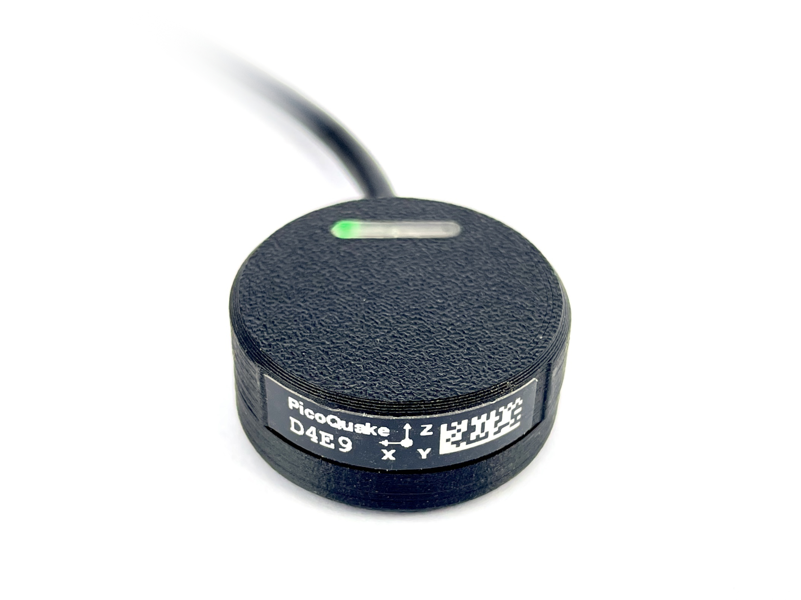

# PicoQuake: USB Vibration Sensor

**Overview:**

*PicoQuake* is a MEMS accelerometer vibration sensor designed to profile a wide range of vibrations. It can capture everything from very low-frequency movements (tall buildings, bridges), to high-frequency vibrations in the kilohertz range (motors, industrial machinery). 

**Key features:**

- **Wide frequency range:** Suitable for both low and high-frequency vibration monitoring.
- **Accessible:** A cost-effective alternative to traditional industrial vibration sensors, which often require proprietary hardware and software.
- **Standalone device:** Connects directly to your computer (Linux, Mac, Windows) via USB.
- **Open-source integration:** Interfaced through an open-source Python driver, providing a command line interface (CLI) and an API for easy integration and customization.

 

---

## Specs

- Accelerometer ranges: ±2 g, ±4 g, ±8 g, ±16 g
- Gyro range: up to ±2000 dps
- Sample rate: 12.5 Hz to 4000 Hz
- Configurable low pass (second order) filter: 42 Hz to 3979 Hz
- IMU sensor: ICM-42688-P
- Connectivity: USB 2.0 Full Speed 12 Mbps CDC via USB Type-C
- Power requirement: 5 V, 50 mA
- Cable length: 2.0 m
- Dimensions: ⌀30 mm x 13 mm

## Noise performance

*PicoQuake* can be used to profile vibrations of very low magnitude, due to the low-noise accelerometer used.

- Low noise configuration (500 Hz sample rate, 42 Hz filter, ±2 g range)
    - X axis noise: < 0.5 mg RMS
    - Y axis noise: < 0.5 mg RMS
    - Z axis noise: < 1.2 mg RMS
- Fastest sample rate, highest range (4 kHz sample rate, 2 kHz filter, ±16 g range)
    - X axis noise: < 2.0 mg RMS
    - Y axis noise: < 2.5 mg RMS
    - Z axis noise: < 3.0 mg RMS

## Where to get

You can buy *PicoQuake* on [*Tindie*](https://www.tindie.com/products/34749/).

