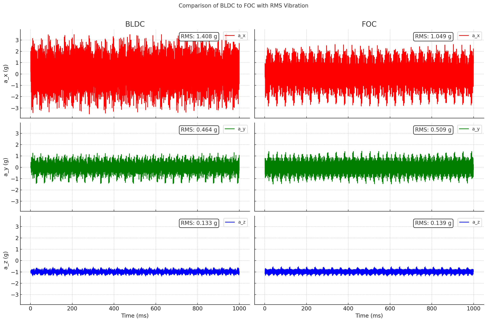
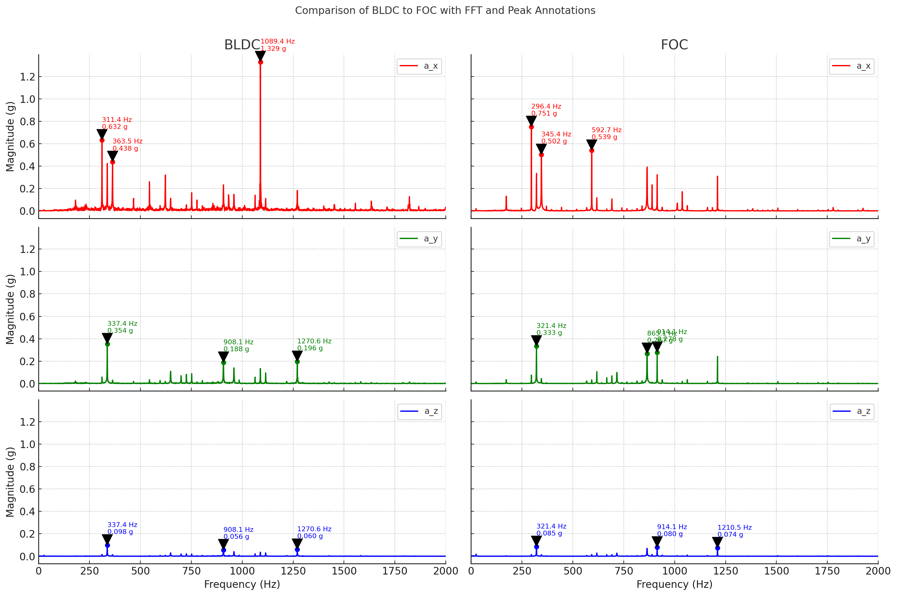

# BLDC Motor Vibrations

Brushless DC motors are a popular choice due to their longevity, efficiency and reasonably low cost. They can be a pretty significant source of vibration, however. 

The two main control algorithms for BLDCs are the basic 6-step trapezoidal BLDC commutation (tldr: turning windings on and off in the correct sequence) and sinusoidal FOC control (tldr: continuous sinusoidal phase currents instead of discrete steps). We wondered how the choice of the control method impacts the vibration produced by the motor.

We carried out a simple comparison test by attaching PicoQuake to a small brushless outrunner motor being controlled by a VESC speed controller. In VESC configuration software, commutation method can be selected.

A one second recording was captured. Looking at the acceleration plots and RMS values, it is clear that FOC generates significantly less vibration. We can also look at the frequency distribution of vibration by generating a FFT plot. Trapezoidal control has a lot of the vibration power concentrated at one frequency, while FOC has multiple peaks of lower power.

As showcased in this example, PicoQuake can be used in BLDC drive applications to optimize for smooth and low noise operation, which can be particularly important in small electric mobility product such as electric bikes, scooters, etc.
