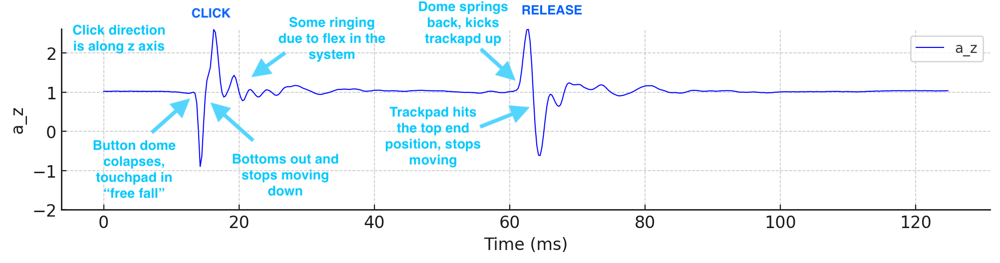
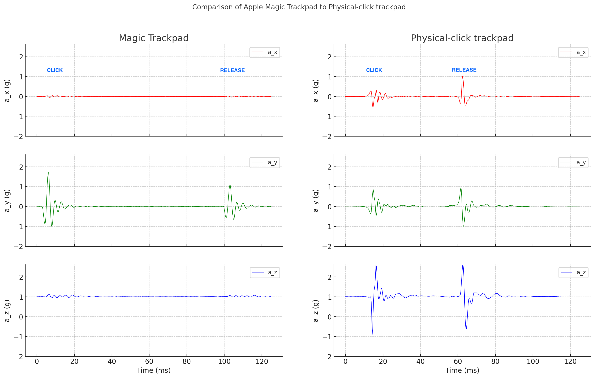

# Trackpad Click

*PicoQuake* can be used to evaluate and optimize all the clicky things - such as the click of a trackpad on a laptop.

Let’s take a look at how a click of a traditional trackpad looks like. This one has a pivot point at the top and a tactile button under it at the bottom. *PicoQuake* was simply pressed lightly against the trackpad while clicking it. A recording was taken at the full 4 kHz sample rate. Trackpad’s direction of travel is aligned with the Z axis of *PicoQuake*.

It’s pretty clear what a click actually consists of. First, as the dome inside the tactile button below the trackpad collapses, it moves down quickly under the force applied. Because the travel is very short (around 0.2 mm), it bottoms out quickly, causing an acceleration jerk. This is the main part that feels like a click. After that, there is some ringing present due to flexibility in the system.

During the release, the opposite happens. When the dome reaches the position at which it springs back, it pushes the trackpad up, causing an acceleration jerk. Quickly after, top position is reached and some ringing follows.

More modern trackpads (such as in Apple MacBooks) work very differently however. Instead of a physical tactile button below the trackpad, a haptic actuator is used to shake the trackpad, emulating a click. It is triggered entirely by software, when sufficient pressing force is detected by a load cell.

Comparing the two with *PicoQuake*, we can see that the acceleration pattern is very similar regarding amplitude and duration. Which checks out, because the Magic Trackpad’s click feels very much like a physical tactile button click.

There is one important difference though - it vibrates in a different axis! Most of the movement is detected in the Y axis (front-back), not Z (up-down). It would appear that human fingers can’t detect the direction of such short bursts of vibration very well. Therefore engineers picked the actuation direction that was the easiest to implement. This is confirmed by looking inside the MacBook. The magnetic actuator is clearly visible and indeed moves the trackpad in the front-back direction.
