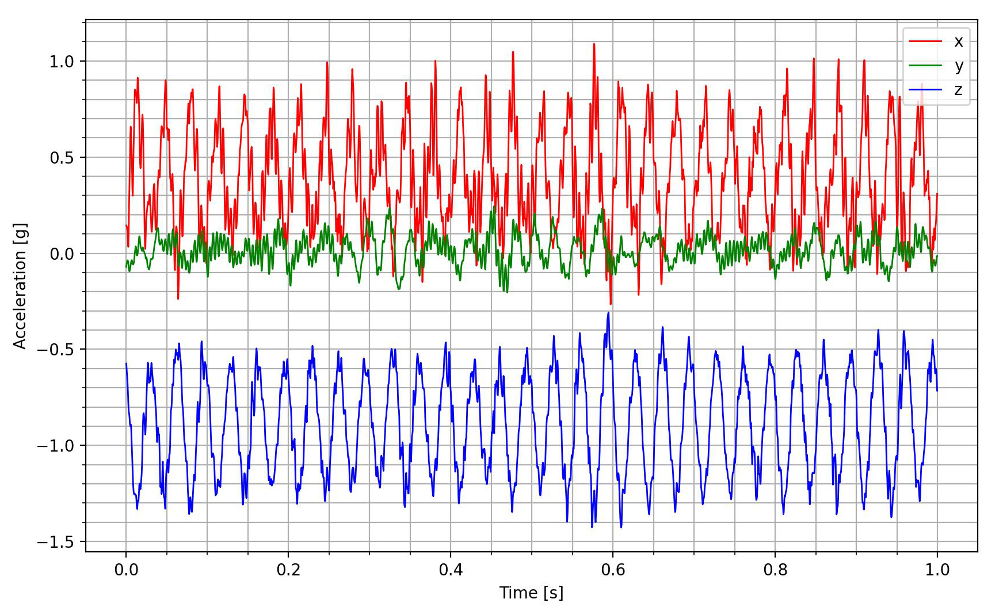
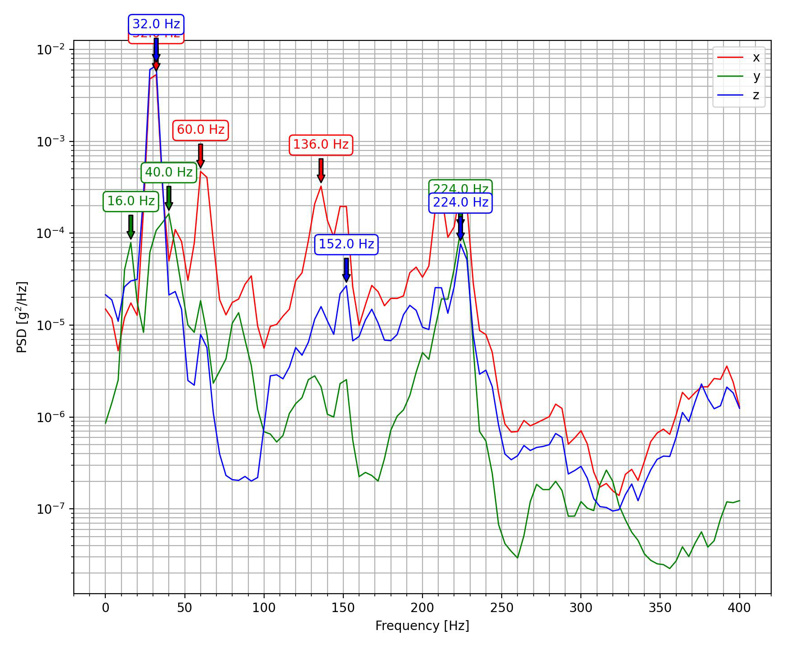
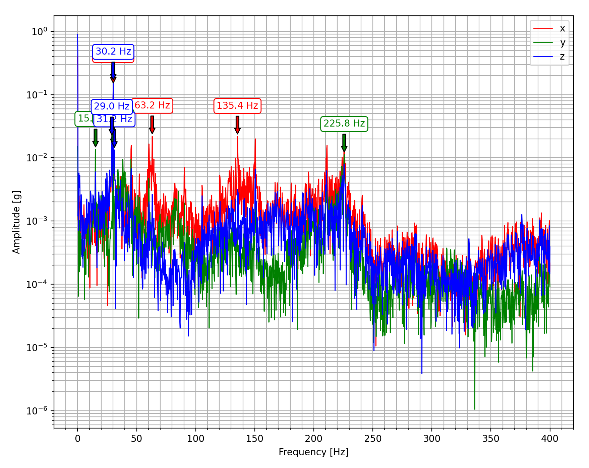

# Plotting

!!! note
    To enable plotting, `picoquake` must be installed with the `plot` extra. See [Installation](installation.md) for more information.

## Plot time series data

Plot time series data from a CSV file.



```bash
picoquake plot <csv_path> <output>
```

You can specify the time range to plot using the `--tstart` and `--tend` arguments.
The axes can be selected using the `-xyz` flag. Input only the desired axes in any order.

For more information about the command, see [CLI reference](cli.md#plot).

## Plot power spectral density (PSD)

Plot power spectral density (PSD) data from a CSV file.

```bash
picoquake plot_psd <csv_path> <output>
```



You can specify the frequency range to plot using the `--fmin` and `--fmax` arguments.
The axes can be selected using the `-xyz` flag. Input only the desired axes in any order.
To annotate peaks, use the `--peaks` flag.

For more information about the command, see [CLI reference](cli.md#plot_psd).

!!! note
    PSD plot filters out the DC component of the signal.

??? info "Power spectral density (PSD)"
    Power Spectral Density (PSD) represents a signal's power distribution across different frequencies. It's commonly used to analyze broadband random signals. The PSD's amplitude is normalized based on the spectral resolution used during signal digitization.

    For vibration data, the PSD is measured in units of g²/Hz. This unit allows for the comparison and overlay of random data regardless of the spectral resolution used in measurement.

## Plot Fast Fourier Transform (FFT)

Plot Fast Fourier Transform (FFT) data from a CSV file.

```bash
picoquake plot_fft <csv_path> <output>
```



You can specify the frequency range to plot using the `--fmin` and `--fmax` arguments.
The axes can be selected using the `-xyz` flag. Input only the desired axes in any order.
To annotate peaks, use the `--peaks` flag.

For more information about the command, see [CLI reference](cli.md#plot_fft).

!!! note
    FFT plot ***does not*** filter out the DC component of the signal.

??? info "Fast Fourier Transform (FFT)"

    Fast Fourier Transform (FFT) is an algorithm that computes the Discrete Fourier Transform (DFT). It's commonly used to analyze the frequency content of a signal. 

    For vibration data, the FFT is measured in units of g. FFT amplitudes between data sets of different lengths (number of samples) are ***not*** directly comparable. This is due to FFT returning the absolute amplitude of frequency components, whose spectral widths are defined by the number of samples used to compute the FFT.

